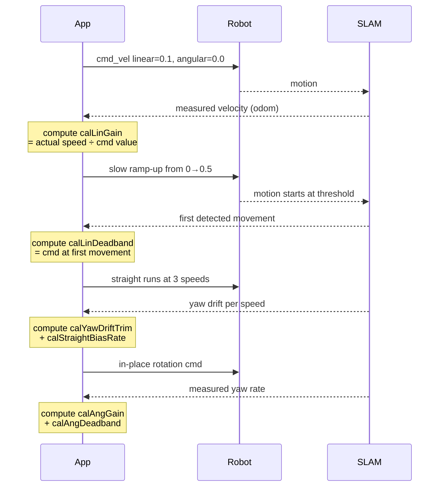

# Drive & Calibrate

Phone on robot, network connected. Time to drive — then calibrate so the robot drives straight.

---

## Prerequisites

- Robot built, ESP32 flashed, and app configured → [Build & Configure](build-and-configure.md)
- Phone mounted landscape, camera facing forward → [Build & Configure → Phone Mounting](build-and-configure.md#phone-mounting)

---

## Part 1 — Drive the Robot

### 1. Start SLAM

Go to the **Scan** tab → tap **Start**.

RTAB-Map builds the map incrementally as the robot moves. Loop closures trigger when the robot revisits a previous area and correct accumulated drift.

{ .img-wide }

!!! note "Lighting and texture matter"
    SLAM works best in well-lit rooms with visual texture (furniture, posters, varied surfaces). Plain white walls or dark corridors reduce loop closure frequency — the phone still tracks via ARKit VIO but drift accumulates.

### 2. Drive the robot

#### Autonomous IDD

Use the virtual joystick on the **Control** tab or a Bluetooth gamepad to control the robot.

{ .img-phone }

!!! tip "ROS2 keyboard / gamepad teleop"
    → [ROS2 Teleoperation (Linux)](../../reference/ros2-linux.md) — drive via `teleop_twist_keyboard` or a Linux gamepad

#### Advanced: goal-based navigation

Publish to `/move_base_simple/goal` (`geometry_msgs/PoseStamped`).

!!! info "What you see in Foxglove"
    The **3D panel** shows two overlapping data layers:

    - `/map` — occupancy grid: **dark** = obstacle, **white** = free space, **gray** = unknown (not yet mapped)
    - The robot's live pose as a TF arrow moving through the map

    Set **Display frame → `map`** in the 3D panel settings so the map stays fixed while the robot moves.
    If the robot appears to spin in place, the frame is set to `odom` or `base_link` — switch it to `map`.

    In **Autonomous IDD** mode, colored rings around obstacles show the costmap inflation zone —
    the safety margin the path planner uses to avoid collisions.

{ .img-wide }

### 3. Monitor in Foxglove

Connect Foxglove Studio to the built-in WebSocket server (address shown in **Settings → Foxglove WebSocket Server**), then add:

- **3D panel** → `/tf`, `/odom`, `/map` — live robot position and map
- **Image panel** → `/camera/image_raw/compressed` — camera view
- **Plot** → `/diag/cpu_percent`, `/battery/voltage` — health

{ .img-wide }

### 4. Try Autonomous IDD

Once the map looks stable:

1. **Settings → Operating Mode** → switch to **Autonomous IDD**
2. **Control** tab → **Actions**

| Action | What it does |
|--------|-------------|
| **Explore** | Autonomously navigates to unmapped frontiers until fully mapped or timeout |
| **Calibrate** | Three options for tuning the drive system |

!!! warning "Experimental features"
    Explore and motor calibration are still being improved. Results vary by environment and hardware. Use with care near fragile objects or drop-offs.

!!! tip "Want autonomous vacuuming?"
    → [Vacuum Robot demo](../../demos/vacuum-robot.md) — add a fan ESC and unlock Explore + Clean modes

The **Control** tab also shows a **Map View** with the occupancy grid and the robot's live position.

---

## Part 2 — Calibrate

!!! note "Autonomous IDD only"
    Calibration is only available — and only meaningful — in **Autonomous IDD** mode. The Sensor Bridge mode does not control motors.

Calibration teaches iROSLink how your specific motors behave: how much command value it takes to move, how fast the robot actually travels, and whether one side pulls harder than the other. Good calibration is the difference between a robot that drives straight and one that spins in circles.

### When to calibrate

- First run with new hardware
- After replacing motors, wheels, or battery
- After firmware changes to the ESP32 motor controller
- When the robot consistently drifts or overshoots during autonomous navigation

### Prerequisites

1. **SLAM is running** — calibration reads actual robot velocity from SLAM odometry.
2. **Robot is on a flat, hard floor** — carpet introduces noise into odometry readings.
3. **At least 1.5 m of clear space** in front of the robot — it will drive in short bursts.
4. **ESP32 is connected** and `/cmd_vel` is enabled in the Topics tab.
5. **Battery is reasonably charged** — low voltage changes motor behaviour and produces inaccurate results.

### Automatic calibration

1. Go to the **Scan** tab and start a SLAM session if not already running.
2. Tap **Actions** → **Calibrate**.
3. A countdown overlay appears:
    - If SLAM is not running: "Starting SLAM in 3…" then "Calibrating in 5…"
    - If SLAM is already running: "Calibrating in 5…"
4. Stand back — the robot will move. Tap **Cancel** at any time during the countdown.



The full routine takes approximately **60–120 seconds** depending on motor response time.

### What gets measured

| Parameter | What it captures |
|-----------|----------------|
| `calLinGain` | cm/s of actual speed per unit of `/cmd_vel` linear value |
| `calLinDeadband` | Minimum `/cmd_vel` value that produces any movement |
| `calLinMinCmS` | Slowest reliable linear speed before the robot stalls |
| `calAngGain` | °/s of actual yaw rate per unit of `/cmd_vel` angular value |
| `calAngDeadband` | Minimum angular command that produces any rotation |
| `calYawDriftTrim` | Fixed yaw bias correction for straight-line driving |
| `calStraightBiasRate` | Speed-dependent yaw correction (stronger motor at higher speeds) |

Results are written to app storage immediately and apply to all future navigation. Check them in **Control → Drive Calibration**.

### Manual fine-tuning

Go to **Control** tab → **Drive Calibration** for direct access to every parameter.

Use manual tuning when:
- Auto-calibration results look wrong (e.g. gain is 0 or unrealistically high)
- You want to adjust one parameter without re-running the full routine
- The robot drifts slightly in one direction even after auto-calibration

The feed-forward formula:

```
motor_cmd = deadband + (velocity / gain)
```

If the robot **overshoots** goals: reduce `calLinGain` slightly.  
If the robot **barely moves**: reduce `calLinDeadband`.  
If it **pulls left/right** when driving straight: adjust `calYawDriftTrim`.

**PI feedback (optional):** Enable `driveLinPIEnabled` / `driveAngPIEnabled` in Drive Calibration. Start with **Kp = 0.01, Ki = 0.001** and increase slowly. Too high Kp → oscillation; too high Ki → wind-up.

!!! warning "PI feedback requires stable odometry"
    If SLAM tracking is unreliable (jumpy pose), PI feedback amplifies the noise. Ensure tracking state is **Normal** before enabling PI.

### Verifying calibration

1. Drive forward in a straight line for ~1 m — the SLAM trace should be nearly straight.
2. Drive in a square pattern — corners should be 90°.
3. Watch drive state in the Scan tab: it should reach **Arrived** consistently at goals.

---

## Troubleshooting

**Map drifts and does not self-correct:**
Check **Settings → SLAM Debug**. If loop closure hypothesis < 0.5, the environment may be too featureless. Add visual texture or reduce `rtabVisMinInliers`.

**Robot drives but app does not receive `/cmd_vel`:**
Confirm `RMW_IMPLEMENTATION=rmw_zenoh_cpp` is set on your ROS2 machine and the Zenoh router is reachable from both the phone and laptop.

**Phone vibrates on the robot:**
Use a firm mount with no flex. Movement artifacts degrade odometry. See [Phone Mounting](build-and-configure.md#phone-mounting).

**Robot doesn't move during calibration:**
Verify ESP32 is connected (peer count ≥ 1) and the joystick produces movement before starting calibration.

**Gain values look wrong after auto-calibration (gain = 0 or > 300):**
Auto-calibration relies on SLAM odometry. Bad results usually mean SLAM was unstable — ensure tracking state is **Normal** before re-running.

Full list → [Troubleshooting](../../reference/troubleshooting.md)

---

## Next steps

→ [Operating Modes reference](../../reference/modes.md) — full mode details
→ [App Stages & Lifecycle](../../reference/app-stages.md) — visual guide to each phase
