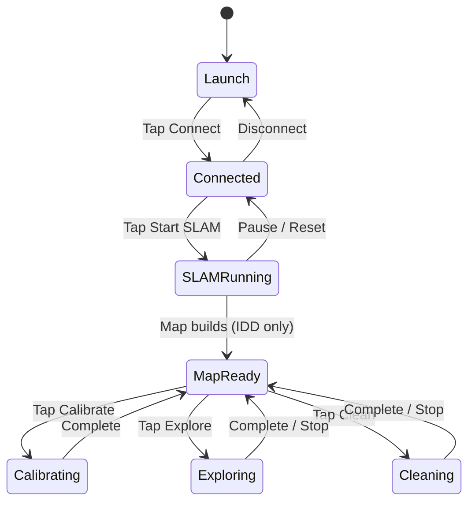

# App Stages & Lifecycle

Visual guide to each phase of the app — what state the robot is in and what actions are available.

---

## Overview

---

## Stage 1 — Launch

Settings tab is active. Status shows "Disconnected". No sensors publishing yet.

→ [Build & Configure](../getting-started/build-robot/build-and-configure.md#app-configuration) — configure Zenoh and operating mode

!!! tip "Screen stays on"
    iROSLink disables the auto-lock timer on launch. You can disable this in settings.

---

## Stage 2 — Connected

Status shows `Connected (N peers)`. 24+ publishers are active. IMU and GPS publish if enabled. SLAM and camera are not yet active.

Verify at least 1 peer (ESP32 or desktop). If 0 peers → [Troubleshooting → Connection issues](troubleshooting.md#connection-issues).

---

## Stage 3 — SLAM Running

Scan tab shows a live 3D point cloud. Tracking state, node count, and loop closure count are shown in the status bar.

→ [Drive & Calibrate](../getting-started/build-robot/drive-and-calibrate.md) — drive the robot and monitor in Foxglove

---

## Stage 4 — Map Ready *(Autonomous IDD only)*

**What you see:** Occupancy grid overlaid on the point cloud. **Calibrate**, **Explore**, and **Clean** actions become available. Control tab joystick is operational.

**What's happening:**
- RTABMap is publishing `/map` (occupancy grid) and `/cost_map` (inflated costmap for planning)
- Map is latched — new subscribers receive the latest version immediately
- Drive, Explore, and Clean managers are idle, waiting for a goal

**Expected occupancy grid:**
- Free space (navigable): light/white cells
- Obstacles: dark/black cells
- Unknown (not yet seen): grey cells

→ [Drive & Calibrate](../getting-started/build-robot/drive-and-calibrate.md#part-2-calibrate) — tune motors before autonomous navigation

---

## Stage 5 — Autonomous Action *(Autonomous IDD only)*

### Calibrating

Robot drives in short bursts (~60–120 s). Stand back. See [Drive & Calibrate](../getting-started/build-robot/drive-and-calibrate.md#part-2-calibrate) for full details.

---

### Exploring

Robot does a 360° spin, then navigates to unexplored frontier cells one by one. Returns home when the map is fully explored or the time limit is reached.

**What you see:** A green path line on the Scan tab map, drive state label updating as it moves.

---

### Cleaning

Robot drives a boustrophedon (zigzag) path across mapped free space. Suction fan runs at `cleanFanSpeed` throttle and stops automatically when complete.

**What you see:** A zigzag path on the map. Progress counter shows `(done / total waypoints)`.

---

## Drive state indicator

Shown on the Scan tab during any autonomous navigation (manual goal, explore, or clean):

| State | Meaning |
|-------|---------|
| `idle` | No active goal |
| `planning` | Running A\* pathfinding |
| `driving (X.Xm)` | Following path; X.X metres remaining |
| `rotating` | At goal, turning to final heading |
| `unstucking (attempt N/3)` | Stuck recovery in progress |
| `arrived` | Goal reached successfully |
| `failed: <reason>` | Navigation ended with error |

**Stuck recovery** tries three escalating actions: forward nudge → backward nudge → 5-second rotation. If all three fail, state becomes `failed: Stuck`. Tap a new goal on the map to resume.

---

## Background behaviour

When you switch away from iROSLink:

- SLAM, sensors, and publishing **pause**
- In **Router mode**: Zenoh router disconnects to release port 7447 (required by iOS)
- Any active drive, explore, or clean action **stops safely** (motors halt, fan stops)

When you return:
- SLAM and sensors **resume**
- If **Auto-connect** is on, the Zenoh session reconnects automatically

!!! warning "Autonomous actions do not resume after backgrounding"
    If the robot was exploring or cleaning when you backgrounded the app, it stops. Tap the action again to restart.

---

## Data tab

→ [Data Tab — Maps & Config](data-tab.md) — save/load maps and configuration, and SLAM map reuse limitations
