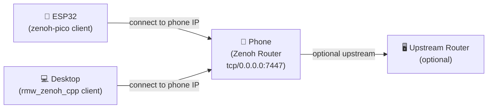
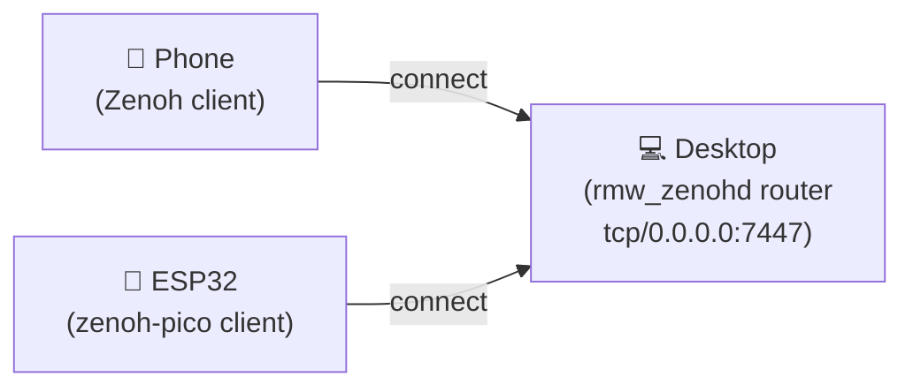

# Zenoh Networking

**Zenoh** is the communication protocol iROSLink uses to send data between the phone, the robot (ESP32), and your laptop. Think of it as the "WiFi for robot data" layer — it routes sensor streams, motor commands, and map data between devices on your network.

iROSLink uses Zenoh as its ROS2 transport layer, replacing the default DDS/UDP transport (`rmw_fastrtps`, `rmw_cyclonedds`) with a protocol that works better across WiFi, NAT, and mixed networks.

!!! tip "Just getting started? Use Router mode"
    Select **Router** in Settings → ROS2 Bridge (Zenoh). The phone becomes the network hub and all other devices connect to it. You don't need a desktop running ROS2 for this to work.

---

## Two connection modes

### Router mode — phone as the hub



The phone listens on **port 7447** and accepts connections from any device on the local network.

**Use this when:**
- You don't have a desktop running ROS2 (simplest setup)
- You want the phone to be the single point of contact for all devices
- The ESP32 connects via phone hotspot → [Hotspot setup](mdns.md#using-iphone-hotspot)

**Configuration:**
1. Select **Router** in Settings → ROS2 Bridge (Zenoh)
2. Note the displayed **IP address** (e.g. `192.168.4.1`) and **mDNS hostname** (e.g. `iphone.local`)
3. On each connecting device, point its Zenoh client at `tcp/<phone-ip>:7447`

**Upstream Router (optional):** If you also have a full ROS2 system with its own Zenoh router, enter its address in the **Upstream Router** field. The phone's router will bridge traffic between local devices and the upstream network.

---

### Client mode — phone connects to external router



The phone dials outbound to an existing Zenoh router. Good when the desktop is already running ROS2 with `rmw_zenoh_cpp`.

**Use this when:**
- Your desktop already runs `rmw_zenohd` as part of a ROS2 setup
- You want the desktop to be the network hub
- You have an existing Zenoh infrastructure

**Configuration:**
1. Select **Client** in Settings → ROS2 Bridge (Zenoh)
2. Start the Zenoh router on your desktop: `ros2 run rmw_zenoh_cpp rmw_zenohd`
3. Enter the desktop address in **Router Address**: `tcp/192.168.1.100:7447`
4. Tap **Connect**

??? note "For ROS2 users — rmw_zenoh_cpp details"
    The phone uses `rmw_zenoh_cpp` under the hood. To use it from your desktop:
    ```bash
    # Install rmw_zenoh_cpp (ROS2 Jazzy example)
    sudo apt install ros-jazzy-rmw-zenoh-cpp
    export RMW_IMPLEMENTATION=rmw_zenoh_cpp

    # Start the Zenoh router (Client mode: phone connects to this)
    ros2 run rmw_zenoh_cpp rmw_zenohd
    ```
    All topics published by the phone appear as standard ROS2 topics. Run `ros2 topic list` to verify.

---

## Why the app shows "Peers", not "Clients"

This is a common point of confusion.

Zenoh uses a **peer-to-peer topology** internally. Even when one device is configured as a "router" and others as "clients", at the session layer every connected device is modelled as a **peer**. The iOS session API (`z_info_peers_zid()`) returns a list of peer identifiers — it does not distinguish between Zenoh "router" role peers and "client" role peers.

**In practice:**
- Each ESP32 running zenoh-pico = **1 peer**
- Each `rmw_zenoh_cpp` node on a desktop = **1 peer** (or more, if multiple nodes are running in separate sessions)
- Any other Zenoh session = **1 peer**

So if you have an ESP32 and one desktop ROS2 node connected in Router mode, you should see **Peers: 2**.

!!! note
    The peer count is a connectivity indicator, not a health metric. A count of 1 or more means Zenoh traffic can flow. Zero means nothing has connected yet.

---

## Connection state reference

| Status shown | Meaning |
|-------------|---------|
| Disconnected | No Zenoh session; no topics publishing |
| Connecting… (attempt N) | Client mode: attempting to reach the router. Retries up to 3 times with 1.5 s between attempts. |
| Connected (N peers) | Session open; publishers and subscriptions are active |

---

## mDNS hostname caveats

The hostname shown in Router mode (e.g. `iphone.local`) is the phone's Bonjour mDNS name. A few things to know:

- mDNS only works on **the same local network segment** (no routing across subnets)
- The hostname is **case-sensitive** — use lowercase: `iphone.local` not `iPhone.local`
- If mDNS resolution fails, use the raw **IP address** shown instead
- On phone hotspot (`192.168.4.x` subnet), mDNS may not work on all clients — prefer the IP

---

## Background disconnect (Router mode)

When you press the home button or switch to another app, iOS suspends iROSLink after a few seconds. In **Router mode**, the app disconnects the Zenoh router *before* iOS suspends it. This is intentional:

- iOS does not allow background TCP server sockets to persist reliably
- Leaving the port claimed while suspended causes "Address already in use" on next launch
- The app reconnects automatically when you return to the foreground (if Auto-connect is enabled)

**In Client mode**, the phone is a client, not a server, so backgrounding is less disruptive — the TCP connection may simply drop and reconnect when the app resumes.

---

## Network topology tips

| Scenario | Recommended setup |
|---------|------------------|
| Phone hotspot + ESP32, no desktop | Router mode; ESP32 connects to `tcp/192.168.4.1:7447` |
| Home WiFi, desktop ROS2, ESP32 | Desktop runs `rmw_zenohd`; phone + ESP32 in Client mode pointing at desktop |
| Phone hotspot + desktop + ESP32 | Router mode; both desktop and ESP32 connect to phone IP |
| Desktop ROS2 + phone on same LAN | Either works; Client mode (desktop as router) is more conventional |
| Remote / cloud routing | Phone in Client mode; point at cloud-hosted Zenoh router |

---

## Troubleshooting connectivity

See [Troubleshooting → Connection issues](../reference/troubleshooting.md#connection-issues) for step-by-step fixes.
